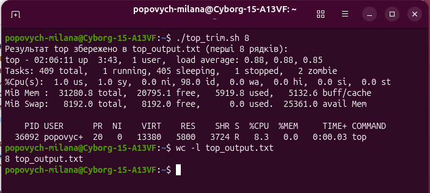
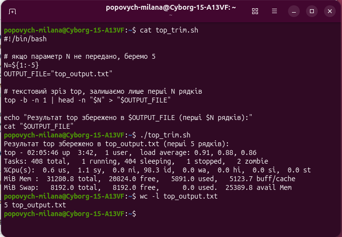

# Лабораторна робота № 1 ІО-46 Попович Мілана
## Тема: Вступ в LINUX. Робота в командному рядку
---
## Завдання
* Завдання 1.1: Відпрацювати команди в наданому списку команд. 
* Завдання 1.2: Автоматизації задач за допомогою Bash-скриптів, завдання за варіантами в файлі Task_Bash_Automation.pdf
Варіант визначається як залишок від ділення номера залікової книжки на 6: `4613 % 6 = 5`

---
## Виконання завдання
Завдання 1.1

*Історія першого терміналу:*
```sh
    1  uname -a
    2  sudo apt update && sudo apt upgrade
    3  cat /etc/apt/sources.list.d/*.sources
    4  sudo apt install -y vim
    5  cd ~
    6  cd ~/Downloads
    7  man ls
    8  ls -l
    9  dpkg -i package.deb
   10  sudo dpkg -i package.deb
   11  cd /
   12  sudo su
   13  exit
   14  echo "hi all"
   15  echo "$PWD hi all here!"
   16  touch hi.sh
   17  echo "$PATH"
   18  vi hi.sh
   19  ./hi.sh
   20  chmod a+x hi.sh
   21  chmod a+rwx hi.sh
   22  ./hi.sh
   23  ./hi.sh Ukraine
   24  cp hi.sh scripts/
   25  cp scripts/ ~/Documents/
   26  cp -r scripts/ ~/Documents/
   27  cd scripts
   28  mv hi.sh ../
   29  cd ..
   30  rm scripts
   31  rm -rf scripts
   32  cd /bin
   33  ls -l
   34  cd ../..
   35  tar -cvf scripts.tar scripts/
   36  cat /etc/passwd
   37  cat /var/log/syslog
   38  tail -n 20 /var/log/syslog
   39  grep -i "profile" /var/log/syslog
   40  cd /
   41  find . -name "dhcp"
   42  find . -name "*dhcp*"
   43  find . name "*dhcp*" | grep -i "dhcp"
   44  find . -name "*dhcp*" | grep -i "etc"
   45  ping -c 4 google.com
   46  (ping google.com &) && date >> ping.log
   47  sudo ping -c 4 google.com
   48  vlc
   49  ls -l
   50  cd /bin
   51  ls
   52  echo $PATH
   53  printenv
   54  whoami
   55  cd /etc/
   56  ls
   57  cd ..
   58  cd /lib
   59  ls
   60  dmesg
   61  sudo dmesg
   62  ls /dev
   63  sudo dmesg -c
   64  dmesg | tail
   65  df -h
   66  cd /home
   67  ls -l
   68  lsmod
   69  cd /proc
   70  cat cpuinfo
   71  echo 1 > /proc/sys/net/ipv4/ip_forward
   72  sudo su
   73  ip addr show
   74  ip link show
   75  cd ~
   76  echo "vika" > 1.txt
   77  cat 1.txt
   78  echo "vasya" > 2.txt
   79  cat 2.txt
   80  diff 1.txt 2.txt
   81  history
   82  lspci
   83  history > history.txt
```
*Результат:*


*Історія другого терміналу:*
```sh
    1  fg 
    2  ps aux | grep ping
    3  kill -15 12064
    4  pgrep -a ping
    5  kill 13235
    6  sudo kill -9 13235
    7  sudo killall vlc
```
---
Завдання 1.2

*Скрипт:*
```sh
#!/bin/bash

# якщо параметр N не передано, беремо 5
N=${1:-5}
OUTPUT_FILE="top_output.txt"

# текстовий зріз top, залишаємо лише перші N рядків
top -b -n 1 | head -n "$N" > "$OUTPUT_FILE"

echo "Результат top збережено в $OUTPUT_FILE (перші $N рядків):"
cat "$OUTPUT_FILE"
```
*Результати тестування:*





---
## Висновки
Під час виконання лабораторної роботи було опановано практичні навички роботи в командній оболонці Bash операційної системи Linux (Ubuntu), створено скрипт для автоматизації 
задач за індивідуальним варіантом.
